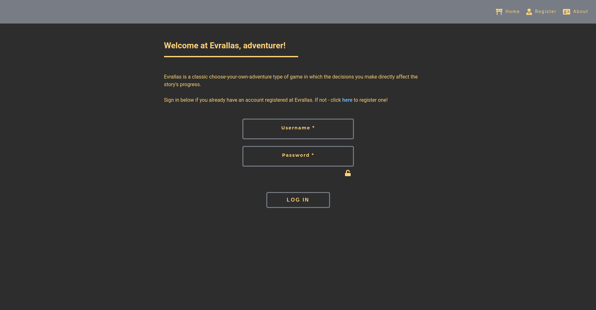
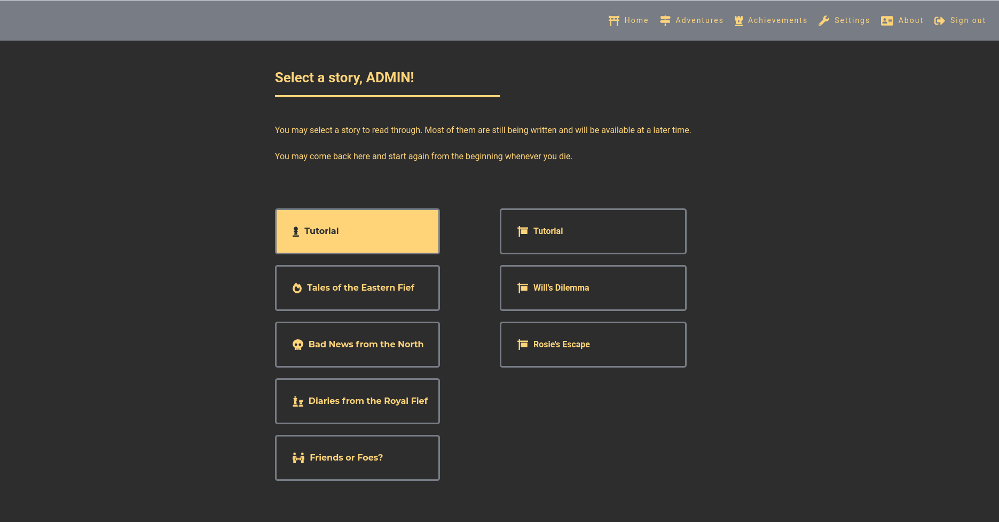
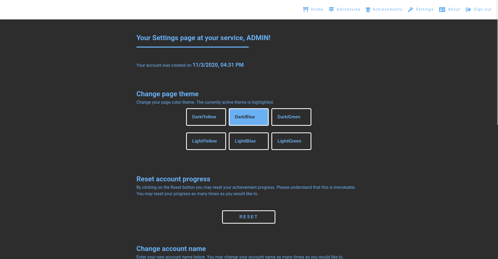
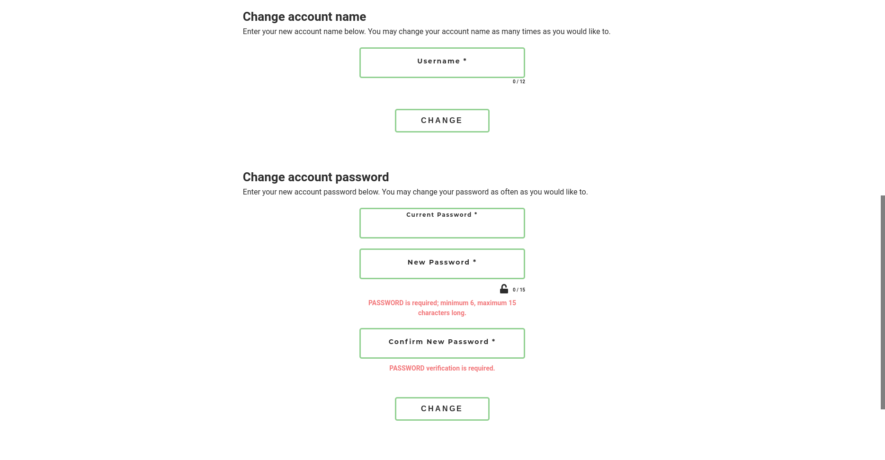

### evrallas || project-004
#### description
+ a React front-end and Node.JS/Express back-end application using MongoDB to store site-specific data. The application is a choose-your-own-adventure story game.
+ it includes multiple adventures to choose from, form submit pages, user statistics and achievements tracking with a possibility to reset account progress, different colour themes and more.
+ to run the application:
  +  check .env_sample to see what is needed for the application to be fully functional. 
  +  rename the file to .env, install the project dependencies and start the application.
  + OR visit the live heroku deployed version [here](https://evrallas.herokuapp.com/). The application is currently running on a free tier option, so it might need a minute or two to boot up.

#### used packages
```
FRONTEND
+ axios                - http client.
+ fontawesome          - icon package.
+ react                - client-side framework.
+ react-ga             - google analytics package.
+ react-helmet         - document head element handler.
+ react-hook-form      - form handling & client-side form validation.
+ react-router-dom     - routing.
+ styled-components    - css-in-js styling.

BACKEND
+ axios                - http client.
+ bcryptjs             - password hashing.
+ cookie-parser        - cookie parsing middleware.
+ cors                 - cors enabling middleware.
+ dotenv               - .env variable loader to store not-public configuration data.
+ express              - server-side framework.
+ helmet               - express securing middleware.
+ jsonwebtoken         - jwt handling.
+ mongoose             - schema-based solution to model data.
+ nodemailer           - email sending module.
```

#### screenshot




