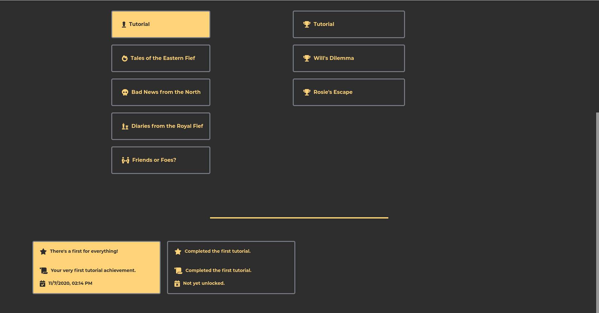

### evrallas || project-004
#### description
+ a Mongo/Express/React/Node application that incorporates a choose-your-own-adventure story game.
+ it includes multiple adventures to choose from, user statistics and achievements tracking with a possibility to reset account progress, 6 different colour themes and more.
+ to run the application:
  + check the .env_sample file to see what is needed for the app to be fully functional.
  + OR visit the live heroku deployed version [here](https://evrallas.herokuapp.com/).

#### used packages
```
BACKEND
+ axios                - http client.
+ bcryptjs             - passwords hashing.
+ cookie-parser        - cookie parsing middleware.
+ cors                 - cors enabling middleware.
+ dotenv               - .env variable loader to store not-public configuration data.
+ express              - server framework.
+ helmet               - express securing middleware.
+ jsonwebtoken         - jwt handling.
+ mongoose             - a schema-based solution for using mongodb data.
+ nodemailer           - email sending module.
+ react-ga             - google analytics package.

FRONTEND
+ axios                - http client.
+ fontawesome          - icon package.
+ react                - front-end framework.
+ react-helmet         - document head element handler.
+ react-hook-form      - form handler & form submission validator.
+ react-router-dom     - routing.
+ styled-components    - css-in-js styling.
```

#### screenshot





#### project structure
```
*
|- .env_sample
|- .gitignore
|- license.md
|- package-lock.json
|- package.json
|- readme.md
|- screenshot_01.png
|- screenshot_02.png
|- screenshot_03.png
|- screenshot_04.png
|- screenshot_05.png
|- server.js
|- CLIENT
  |- .gitignore
  |- jsconfig.json
  |- package-lock.json
  |- package.json
  |- PUBLIC
    |- favicon.ico
    |- index.html
  |- SRC
    |- index.js
    |- COMPONENTS
      |- COMMONCOMPONENTS
        |- FORM-RELATED
          |- index.js
          |- CHARACTERCOUNTER
            |- CharacterCounter.js
            |- index.js
          |- ERRORMESSAGE
            |- ErrorMessage.js
            |- index.js
          |- ERRORMESSAGEWRAPPER
            |- ErrorMessageWrapper.js
            |- index.js
          |- FORM
            |- Form.js
            |- index.js
          |- FORMWRAPPER
            |- FormWrapper.js
            |- index.js
          |- INPUT
            |- index.js
            |- Input.js
          |- INPUTHELPERWRAPPER
            |- index.js
            |- InputHelperWrapper.js
          |- LABEL
            |- index.js
            |- Label.js
          |- SUBMIT
            |- index.js
            |- Submit.js
          |- TEXTAREA
            |- index.js
            |- Textarea.js
          |- TOGGLEPASSWORD
            |- index.js
            |- TogglePassword.js
        |- GENERAL
          |- index.js
          |- HORIZONTALLINE
            |- HorizontalLine.js
            |- index.js
          |- LAYOUTCONTAINER
            |- index.js
            |- LayoutContainer.js
          |- LOADINGSPINNER
            |- index.js
            |- LoadingSpinner.js
          |- MESSAGETEXT
            |- index.js
            |- MessageText.js
          |- MESSAGETITLE
            |- index.js
            |- MessageTitle.js
          |- SPANBOLD
            |- index.js
            |- SpanBold.js
        |- NAVIGATION-RELATED
          |- index.js
          |- NAVIGATIONLINK
            |- index.js
            |- NavigationLink.js
        |- STYLED-ICONS
          |- index.js
          |- ICONDARK
            |- IconDark.js
            |- index.js
          |- ICONLIGHT
            |- IconLight.js
            |- index.js
        |- TILE-RELATED
          |- index.js
          |- ARCTILE
            |- ArcTile.js
            |- index.js
          |- TILEBUTTON
            |- index.js
            |- TileButton.js
          |- TILECONTAINER
            |- index.js
            |- TileContainer.js
      |- LAYOUTCOMPONENTS
        |- ABOUT
          |- index.js
          |- CONTACTFORM
            |- ContactForm.js
            |- index.js
          |- LOGGEDOUTINFORMATION
            |- index.js
            |- LoggedOutInformation.js
            |- MESSAGE
              |- index.js
              |- Message.js
            |- TITLE
              |- index.js
              |- Title.js
          |- PAGEINFORMATION
            |- index.js
            |- PageInformation.js
            |- MESSAGE
              |- index.js
              |- Message.js
            |- TITLE
              |- index.js
              |- Title.js
        |- ACHIEVEMENTS
          |- index.js
          |- ACHIEVEMENTSDISPLAY
            |- AchievementsDisplay.js
            |- index.js
            |- LISTACHIEVEMENTS
              |- index.js
              |- ListAchievements.js
            |- LISTARCTILES
              |- index.js
              |- ListArcTiles.js
            |- LISTSTORYTILES
              |- index.js
              |- ListStoryTiles.js
              |- STORYTILE
                |- index.js
                |- StoryTile.js
          |- PAGEINFORMATION
            |- index.js
            |- PageInformation.js
            |- MESSAGE
              |- index.js
              |- Message.js
            |- TITLE
              |- index.js
              |- Title.js
          |- USERSTATISTICS
            |- index.js
            |- UserStatistics.js
        |- ADVENTURES
          |- GAMELOST
            |- index.js
            |- PAGEINFORMATION
              |- index.js
              |- PageInformation.js
              |- MESSAGE
                |- index.js
                |- Message.js
              |- TITLE
                |- index.js
                |- Title.js
          |- GAMEWON
            |- index.js
            |- PAGEINFORMATION
              |- index.js
              |- PageInformation.js
              |- MESSAGE
                |- index.js
                |- Message.js
              |- TITLE
                |- index.js
                |- Title.js
          |- STORYPLAY
            |- index.js
            |- GAMEMAINPAGE
              |- index.js
              |- GameMainPage.js
              |- LISTEVENTACHIEVEMENT
                |- index.js
                |- ListEventAchievement.js
              |- LISTEVENTCHOICES
                |- index.js
                |- ListEventChoices.js
              |- LISTEVENTPARAGRAPHS
                |- index.js
                |- ListEventParagraphs.js
              |- PAGEINFORMATION
                |- index.js
                |- PageInformation.js
                |- MESSAGE
                  |- index.js
                  |- Message.js
                |- TITLE
                  |- index.js
                  |- Title.js
          |- STORYSELECTION
            |- index.js
            |- ADVENTURETILECONTAINER
              |- AdventureTileContainer.js
              |- index.js
              |- DISPLAYEDSTORIES
                |- DisplayedStories.js
                |- index.js
                |- STORYTILE
                  |- index.js
                  |- StoryTile.js
              |- PAGEINFORMATION
                |- index.js
                |- PageInformation.js
                |- MESSAGE
                  |- index.js
                  |- Message.js
                |- TITLE
                  |- index.js
                  |- Title.js
        |- HOME
          |- index.js
          |- LOGGEDINTEXT
            |- index.js
            |- LoggedInText.js
          |- LOGGEDOUTTEXT
            |- index.js
            |- LoggedOutText.js
          |- LOGINFORM
            |- index.js
            |- LoginForm.js
          |- PAGEINFORMATION
            |- index.js
            |- PageInformation.js
            |- MESSAGE
              |- index.js
              |- Message.js
            |- TITLE
              |- index.js
              |- Title.js
        |- PAGENOTFOUND
          |- index.js
          |- PAGEINFORMATION
            |- index.js
            |- PageInformation.js
            |- MESSAGE
              |- index.js
              |- Message.js
            |- TITLE
              |- index.js
              |- Title.js
        |- REGISTER
          |- index.js
          |- PAGEINFORMATION
            |- index.js
            |- PageInformation.js
            |- MESSAGE
              |- index.js
              |- Message.js
            |- TITLE
              |- index.js
              |- Title.js
          |- REGISTERFORM
            |- index.js
            |- RegisterForm.js
        |- SETTINGS
          |- index.js
          |- CHANGECOLORTHEME
            |- index.js
            |- ChangeColorTheme.js
            |- CHANGETILES
              |- ChangeTiles.js
              |- index.js
          |- CHANGENAME
            |- ChangeName.js
            |- index.js
            |- NAMECHANGEFORM
              |- index.js
              |- NameChangeForm.js
          |- CHANGEPASSWORD
            |- ChangePassword.js
            |- index.js
            |- PASSWORDCHANGEFORM
              |- index.js
              |- PasswordChangeForm.js
          |- DELETEACCOUNT
            |- DeleteAccount.js
            |- index.js
            |- ACCOUNTDELETEFORM
              |- AccountDeleteForm.js
              |- index.js
          |- PAGEINFORMATION
            |- index.js
            |- PageInformation.js
            |- MESSAGE
              |- index.js
              |- Message.js
            |- TITLE
              |- index.js
              |- Title.js
          |- RESETACHIEVEMENTS
            |- index.js
            |- ResetAchievements.js
            |- RESETACHIEVEMENTSFORM
              |- index.js
              |- ResetAchievementsForm.js
        |- SUCCESSFULUPDATE
          |- index.js
          |- PAGEINFORMATION
            |- index.js
            |- PageInformation.js
            |- MESSAGE
              |- index.js
              |- Message.js
            |- TITLE
              |- index.js
              |- Title.js
        |- TERMS
          |- index.js
          |- PAGEINFORMATION
            |- index.js
            |- PageInformation.js
            |- MESSAGE
              |- index.js
              |- Message.js
            |- TITLE
              |- index.js
              |- Title.js
        |- UNDERCONSTRUCTION
          |- index.js
          |- PAGEINFORMATION
            |- index.js
            |- PageInformation.js
            |- MESSAGE
              |- index.js
              |- Message.js
            |- TITLE
              |- index.js
              |- Title.js
      |- MAINCOMPONENTS
        |- App.js
        |- index.js
        |- NAVBAR
          |- index.js
          |- Navbar.js
        |- PRIVATEROUTE
          |- index.js
          |- PrivateRoute.js
    |- CONTEXT
      |- UserContext.js
    |- LAYOUTS
      |- About.js
      |- Achievements.js
      |- AdventuresGameResultLose.js
      |- AdventuresGameResultWin.js
      |- AdventuresGameStart.js
      |- AdventuresMainPage.js
      |- AdventuresUnderConstruction.js
      |- Home.js
      |- index.js
      |- PageNotFound.js
      |- Register.js
      |- Settings.js
      |- SuccessfulUpdate.js
      |- Terms.js
    |- UTILITIES
      |- index.js
      |- ADVENTURESMETADATA
        |- adventuresMetaData.js
        |- index.js
      |- ICONLIST
        |- iconList.js
        |- index.js
      |- SCROLLTOTOP
        |- index.js
        |- scrollToTop.js
      |- STORIES
        |- a1s1.json
        |- tutorial01.json
        |- tutorial02.json
        |- tutorial03.json
      |- THEME
        |- colorTheme.js
        |- index.js
        |- propertyTheme.js
|- MIDDLEWARE
  |- authorization.js
|- MODELS
  |- userModel.js
|- ROUTES
  |- ACHIEVEMENT
    |- counter.js
    |- index.js
    |- reset.js
    |- showcase.js
    |- store.js
    |- trigger.js
  |- ADVENTURE
    |- index.js
    |- nextevent.js
    |- savedgameid-get.js
    |- savedgameid-set.js
  |- CONTACT
    |- form-msg-from-evrallas.js
    |- form-msg-to-evrallas.js
    |- index.js
  |- USER
    |- change-name.js
    |- change-password.js
    |- delete.js
    |- index.js
    |- login.js
    |- logout.js
    |- register.js
    |- root.js
    |- theme-get.js
    |- theme-set.js
    |- token-validity.js
  |- UTILITIES
    |- HELPERS
      |- createToken.js
      |- maxAge.js
      |- regex.js
```

### latest changes
+ v0.2.20
  + pushed to heroku;
  + readme.md update;
  + added screenshots;